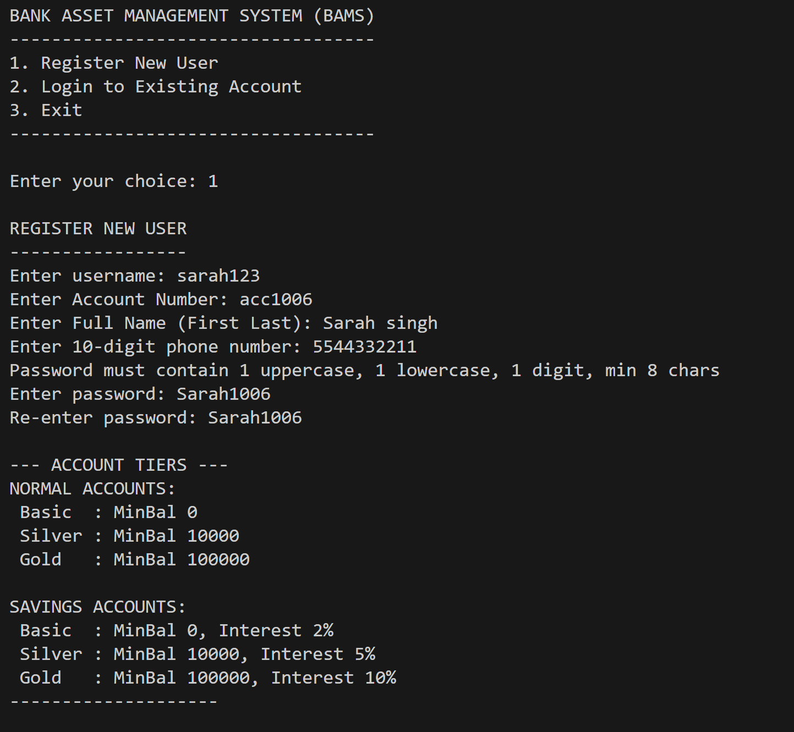

# Encrypted Bank Asset Management System (BAMS)

## Project Overview
The **Encrypted Bank Asset Management System (BAMS)** is a C++ based banking platform designed to combine essential financial operations with personal asset management and transaction transparency. The system integrates a **Budgeting Module** to help users track their spendable income and a **blockchain-inspired ledger** to ensure that every financial activity is recorded with unique hashes for data integrity.

## Objectives
* **Core Banking Functions:** Support for user registration, deposits, withdrawals, transfers, and tiered account upgrades (Basic, Silver, Gold).
* **Budgeting & Asset Management:** Efficient tracking of income (salary), management of recurring bills, and calculation of spending summaries to help users plan their finances.
* **Demonstrative Security:** Implementation of password hashing (DJB2 algorithm), simple XOR encryption for file storage, and account lockout mechanisms to protect user credentials.
* **Transaction Traceability:** A blockchain structure where every financial activity is recorded in linked blocks to maintain transaction integrity.
* **Persistence:** File-based storage allows user accounts, bill history, and transaction ledgers to persist across multiple sessions.

## Architecture & OOP Concepts
This project demonstrates key Object-Oriented Programming principles:
1. **Encapsulation:** Controlled access to user data (passwords, balances) using private methods and public interfaces.
2. **Abstraction:** Hiding complex transaction and blockchain logic behind simple class methods.
3. **Inheritance:** Utilizes hierarchical and multilevel inheritance for tiered accounts and specialized savings variants.
4. **Polymorphism:** Runtime polymorphism through virtual `display()` functions and dynamic casting for account type identification.
5. **Operator Overloading:** The `+=` operator is overloaded to intuitively add transaction records to blockchain blocks.
6. **Templates:** The `Account<T>` base class uses templates to support different data types for account balances.

## Project Structure
| Module | File(s) | Description |
| :--- | :--- | :--- |
| **Account** | `Account.h/cpp` | Manages account tiers and interest rates. |
| **Signup** | `Signup.h/cpp` | Handles registration, authentication, and basic XOR encryption. |
| **Blockchain** | `Block.h/cpp` | Implements the linked-block structure and DJB2 hashing. |
| **Transaction** | `Transactions.h/cpp` | Processes transfers, deposits, and withdrawal logic. |
| **Budget** | `Budget.h/cpp` | Manages bills, salaries, and spending summaries. |
| **Main** | `main.cpp` | Central controller for user dashboards and system state. |

## Project Output Screenshots




## ⚠️ Security Note
Please note that the encryption (XOR) and hashing (DJB2) methods used in this project are for **educational and demonstrative purposes only**. They provide basic data obfuscation for academic exploration but are not intended for high-security real-world financial applications.

## Getting Started
1. **Clone the Repository:**
   ```bash
   git clone [https://github.com/your-username/Encrypted-Bank-Asset-Management-System.git.git](https://github.com/your-username/Encrypted-Bank-Asset-Management-System.git)
2.  **Compile the Project:**
    ```bash
    g++ main.cpp Signup.cpp Block.cpp Transactions.cpp Account.cpp Budget.cpp -o BAMS
    ```
3.  **Run the Application:**
    ```bash
    ./BAMS
    ```

## 📜 License
This project is licensed under the MIT License - see the [LICENSE] file for details.

## 👥 Contributors
* **Sonali Reddy Maddi** 
* **Vootada Vennela** 

---
*Developed for the Object Oriented Programming Course (CS2000) under Dr. Mukku Nisanth Kartheek.*
